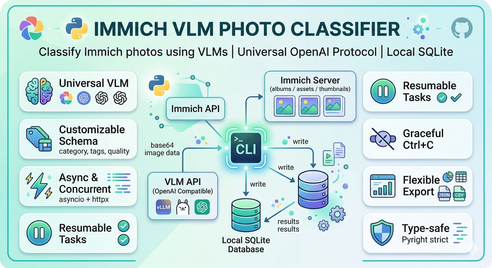

# immich-classify

A Python CLI tool that classifies photos in [Immich](https://immich.app/) using Vision Language Models (VLM). It fetches images via the Immich API, sends them to any OpenAI-compatible VLM for structured classification, and stores results in a local SQLite database for querying and export.



## Features

- **Universal VLM support** - Works with vLLM, Ollama, OpenAI, and any OpenAI-compatible API via structured output (`response_format`)
- **Customizable schema** - Define your own classification fields (category, tags, quality, NSFW, etc.) by subclassing `BasePrompt`, or use built-in presets for common tasks
- **AI-assisted prompt generation** - Describe your goal in natural language and let a strong LLM generate the prompt config for you
- **Async & concurrent** - Built on `asyncio` + `httpx` with configurable concurrency via semaphore
- **Resumable tasks** - Every result is persisted immediately; pause/resume without losing progress
- **Graceful Ctrl+C** - Interrupt a running task to pause it; resume later from where it stopped
- **Flexible export** - Query results with dynamic JSON field filtering; output as table, JSON, or CSV
- **Type-safe** - Full type annotations passing Pyright strict mode with zero errors

## Requirements

- Python 3.11+
- [uv](https://docs.astral.sh/uv/) (recommended) or pip
- A running [Immich](https://immich.app/) server
- An OpenAI-compatible VLM API endpoint (vLLM, Ollama, OpenAI, etc.)

## Installation

```bash
git clone https://github.com/your-username/immich-classify.git
cd immich-classify
uv sync
```

## Configuration

Copy the example environment file and fill in your values:

```bash
cp .env.example .env
```

| Variable | Description | Default |
|----------|-------------|---------|
| `IMMICH_API_URL` | Immich server URL | *required* |
| `IMMICH_API_KEY` | Immich API key | *required* |
| `VLM_API_URL` | OpenAI-compatible API base URL | `http://localhost:8000/v1` |
| `VLM_API_KEY` | VLM API key | `no-key` |
| `VLM_MODEL_NAME` | Model name (empty = server default) | |
| `CLASSIFY_DB_PATH` | SQLite database path | `./classify.db` |
| `CLASSIFY_CONCURRENCY` | Max concurrent image processing | `1` |
| `CLASSIFY_TIMEOUT` | VLM request timeout in seconds | `60` |
| `CLASSIFY_IMAGE_SIZE` | `thumbnail` or `original` | `thumbnail` |

Environment variables override `.env` file values.

## Usage

### Quick start

```bash
# 1. List albums to find the target
immich-classify albums

# 2. Debug with a small batch first
immich-classify debug --album <album_id> --count 5

# 3. Run full classification
immich-classify classify --album <album_id>

# 4. Check progress
immich-classify status --task <task_id>

# 5. View results
immich-classify results --task <task_id> --filter category=people --format table

# 6. Export for review
immich-classify results --task <task_id> --format csv > results.csv
```

### Commands

```
immich-classify albums
    List all Immich albums with ID, name, and asset count.

immich-classify classify --album <id> [--album <id2>] [--prompt-config <file>] [--concurrency <n>]
    Create and run a classification task. Supports multiple albums.

immich-classify debug --album <id> [--count <n>] [--prompt-config <file>]
    Run a small debug batch (default 10) and print results. No database writes.

immich-classify generate --goal <description> [--output <file.py>] [--api-url <url>] [--api-key <key>] [--model <name>]
    AI-generate a prompt config from a natural language task description.

immich-classify status [--task <task_id>]
    Show all tasks, or detailed progress for a specific task.

immich-classify results --task <id> [--filter <key=value>]... [--format json|csv|table]
    Query classification results with optional field filtering.

immich-classify pause --task <id>       Pause a running task.
immich-classify resume --task <id>      Resume a paused task.
immich-classify cancel --task <id>      Cancel a task (keeps existing results).
```

### Custom classification schema

Create a Python file that subclasses `BasePrompt` with a `@register_prompt` decorator:

```python
# my_schema.py
from dataclasses import dataclass, field

from immich_classify.prompt_base import BasePrompt, SchemaField, register_prompt

@register_prompt
@dataclass
class MyPrompt(BasePrompt):
    prompt_type: str = "my_custom"
    system_prompt: str = (
        "You are a photo organizer. Classify the image into the given schema. "
        "Output ONLY valid JSON."
    )
    user_prompt: str = (
        "Classify this image according to the following schema:\n"
        "{schema_description}\n\n"
        "Output a JSON object with the specified fields."
    )
    schema: dict[str, SchemaField] = field(default_factory=lambda: {
        "scene": SchemaField(
            field_type="string",
            description="Scene type",
            enum=["indoor", "outdoor", "studio", "unknown"],
        ),
        "people_count": SchemaField(
            field_type="int",
            description="Number of people visible",
        ),
        "is_screenshot": SchemaField(
            field_type="bool",
            description="Whether the image is a screenshot",
        ),
        "tags": SchemaField(
            field_type="list[string]",
            description="Descriptive tags",
        ),
    })

prompt = MyPrompt()
```

Then use it:

```bash
immich-classify classify --album <id> --prompt-config my_schema.py
```

### Built-in prompt

A default `ClassificationPrompt` is provided in `src/immich_classify/prompts/classification.py`:

| Class | `prompt_type` | Fields | Use case |
|-------|---------------|--------|----------|
| `ClassificationPrompt` | `classification` | category, quality, tags | General image classification (default) |

When no `--prompt-config` is specified, the CLI uses this prompt automatically.

You can subclass `BasePrompt` to create your own prompt for any task:

```python
# smile_check.py
from dataclasses import dataclass, field

from immich_classify.prompt_base import BasePrompt, SchemaField, register_prompt

@register_prompt
@dataclass
class SmileDetectionPrompt(BasePrompt):
    prompt_type: str = "smile_detection"
    system_prompt: str = (
        "You are a facial expression analysis assistant. "
        "Analyze the given image for people and their expressions. "
        "Output ONLY valid JSON, no other text."
    )
    user_prompt: str = (
        "Analyze facial expressions in this image:\n"
        "{schema_description}\n\n"
        "Output a JSON object."
    )
    schema: dict[str, SchemaField] = field(default_factory=lambda: {
        "has_people": SchemaField(field_type="bool", description="Whether the image contains people"),
        "has_smile": SchemaField(field_type="bool", description="Whether anyone is smiling", default=False),
    })

prompt = SmileDetectionPrompt()
```

```bash
# Classify and then filter for smiling photos
immich-classify classify --album <id> --prompt-config smile_check.py
immich-classify results --task <id> --filter has_smile=true
```

### AI-assisted prompt generation

Don't want to write a schema by hand? Use the `generate` command to let a strong LLM create one from a natural language description:

```bash
# Generate and preview a prompt config
immich-classify generate --goal "判断照片中的人物是否在微笑"

# Generate and export to a file
immich-classify generate --goal "挑选不含人物的风景照片" --output landscape_filter.py

# Use a different (stronger) model for generation
immich-classify generate \
  --goal "classify food photos by cuisine type and presentation quality" \
  --output food_classifier.py \
  --api-url https://api.openai.com/v1 \
  --api-key sk-... \
  --model gpt-4o
```

The typical workflow is: **generate → test → refine → run**:

```bash
# 1. Generate a prompt config
immich-classify generate --goal "find photos with cats" --output cat_finder.py

# 2. Test with a small batch
immich-classify debug --album <id> --prompt-config cat_finder.py --count 5

# 3. Edit cat_finder.py if needed (it's a standard Python file)

# 4. Run full classification
immich-classify classify --album <id> --prompt-config cat_finder.py

# 5. Query results
immich-classify results --task <id> --filter has_cat=true
```

## Architecture

```
src/immich_classify/
├── config.py              # Config dataclass, .env loading, validation
├── prompt_base.py         # BasePrompt base class, SchemaField & prompt registry
├── prompts/
│   └── classification.py  # ClassificationPrompt - default implementation
├── prompt_generator.py    # AI-assisted prompt config generation & export
├── immich_client.py       # Async Immich API client (httpx)
├── vlm_client.py          # Async OpenAI-compatible VLM client (httpx)
├── database.py            # Async SQLite layer (aiosqlite)
├── engine.py              # Task execution engine (asyncio + semaphore)
├── cli.py                 # CLI entry point and subcommand handlers
└── __main__.py            # python -m entry point
```

**Key design decisions:**

- **Base / implementation separation** - ``BasePrompt`` in ``prompt_base.py`` provides schema tooling, JSON (de)serialization and the ``register_prompt`` decorator.  Concrete prompts live under ``prompts/`` and are discovered via the registry, making it easy to add AI-generated prompts as new files.
- **SQLite with `json_extract()`** - Classification fields are fully dynamic. Results are stored as JSON and queried with SQLite's JSON functions, so no schema migration is needed when fields change.
- **Structured Output** - Uses `response_format: { type: "json_schema" }` to enforce valid JSON output from the VLM, rather than fragile regex parsing.
- **Per-asset persistence** - Each image result is committed immediately. A crash or interrupt loses at most the in-flight images, not the entire batch.
- **Asset deduplication** - When classifying multiple albums, assets appearing in more than one album are automatically deduplicated.

## Development

```bash
# Install dev dependencies
uv sync

# Run tests
uv run pytest

# Run type checker (strict mode)
uv run pyright src/immich_classify/
```

### Test suite

95 tests covering all modules:

| Module | Tests | Coverage |
|--------|-------|----------|
| `config.py` | 8 | Validation, env loading, defaults, missing fields |
| `prompt_base.py` + `prompts/` | 20 | Schema generation, JSON schema, serialization roundtrip, registry |
| `prompt_generator.py` | 6 | Export to Python, AI generation with mock, error handling |
| `database.py` | 11 | CRUD, filtering with `json_extract`, deduplication |
| `immich_client.py` | 5 | Album listing, asset filtering, image download |
| `vlm_client.py` | 17 | Success, API errors, invalid JSON, structured output, markdown stripping |
| `engine.py` | 9 | Concurrency, error continuation, pause/resume, dedup |
| `cli.py` | 19 | Argument parsing, filter parsing, multi-album |

## Tech Stack

| Component | Choice | Rationale |
|-----------|--------|-----------|
| Language | Python 3.11+ | Rapid iteration, rich async ecosystem |
| HTTP | [httpx](https://www.python-httpx.org/) | Native async, connection pooling |
| Database | [aiosqlite](https://github.com/omnilib/aiosqlite) | Async SQLite, zero setup |
| Logging | [loguru](https://github.com/Delgan/loguru) | Structured, colorful, zero config |
| CLI | argparse | Standard library, no extra dependency |
| Formatting | [tabulate](https://github.com/astanin/python-tabulate) | Clean table output |
| Type checking | [Pyright](https://github.com/microsoft/pyright) | Strict mode, zero errors |
| Package manager | [uv](https://docs.astral.sh/uv/) | Fast, reliable, modern |

## License

MIT
